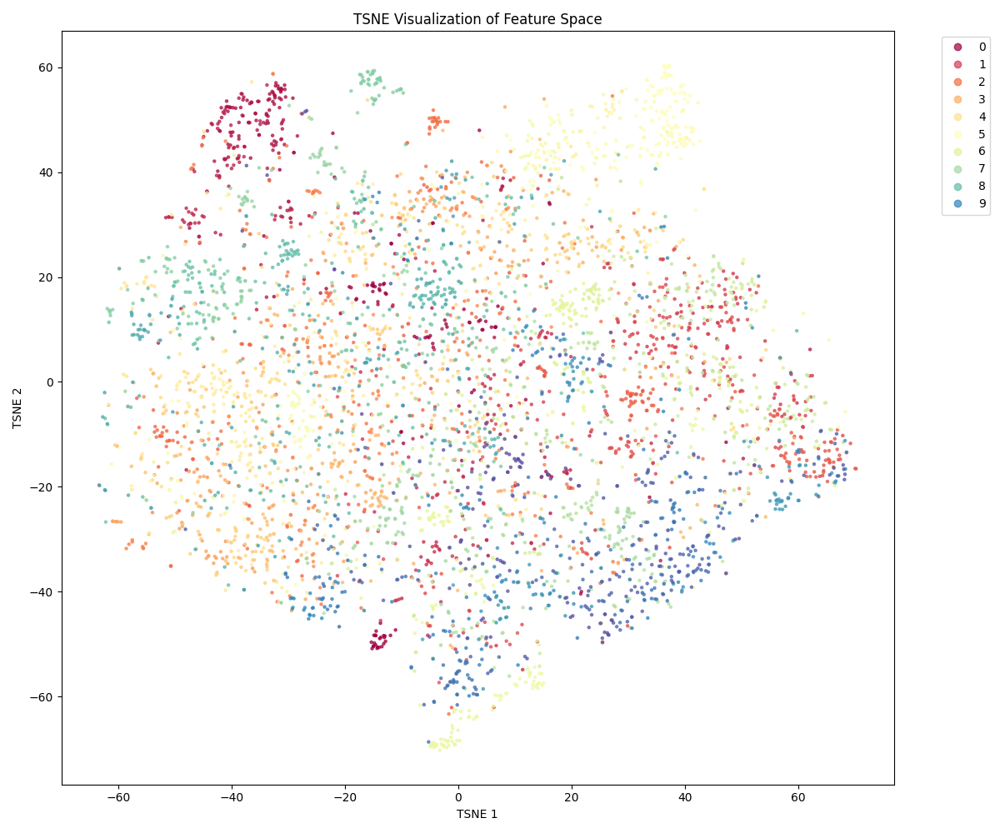
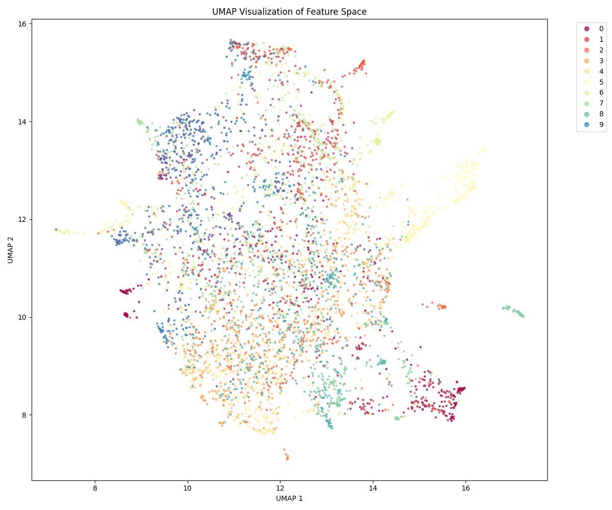
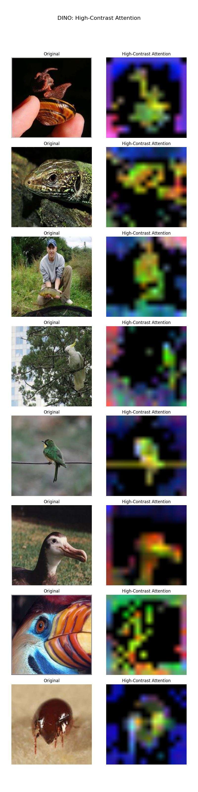
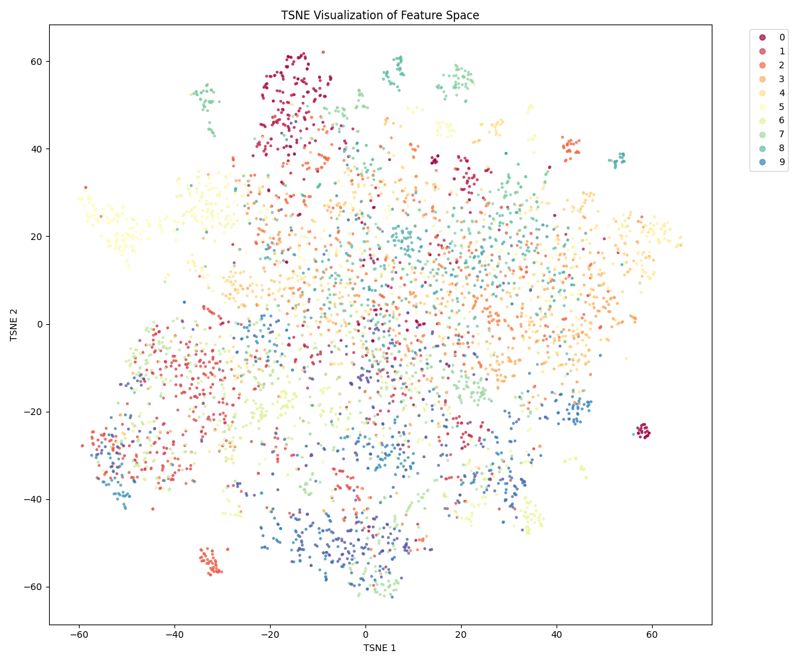
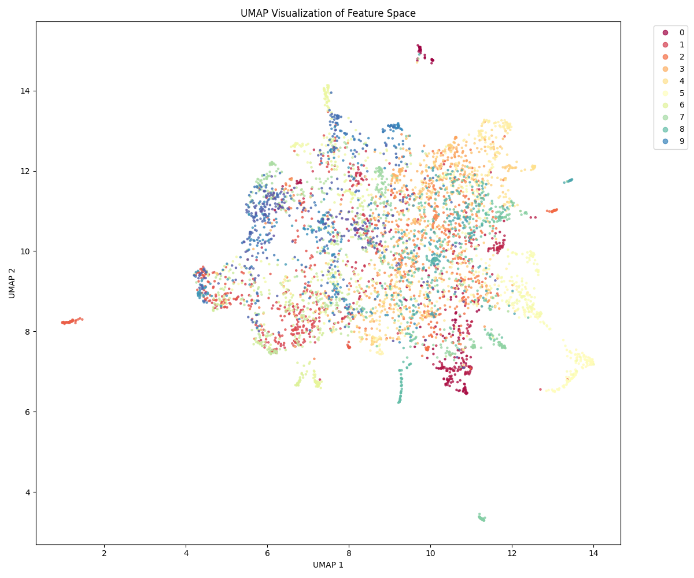
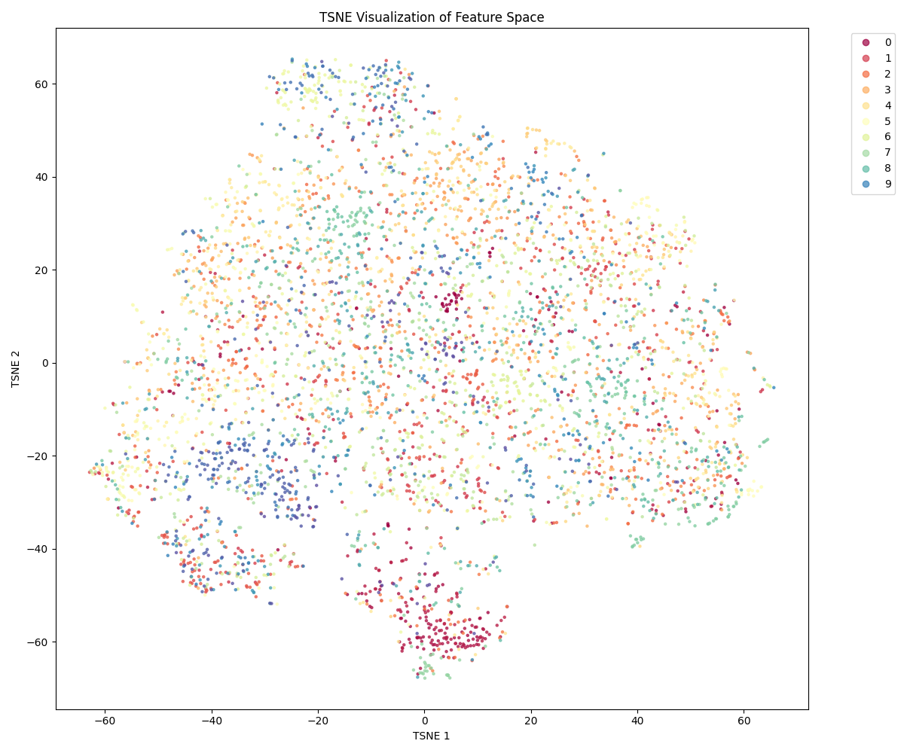

# Self-Supervised Visual Representation Learning

A comprehensive implementation of modern self-supervised learning methods for visual representation learning. This repository includes three state-of-the-art SSL methods with pre-trained models achieving significant improvements over previous versions.

## Key Improvements

| Method | Previous | Current | Improvement |
|--------|----------|---------|------------|
| **SimCLR** | 34.25% | 60.22% (Linear) / 54.92% (k-NN) | +76% |
| **MAE** | 25.08% | 58.12% (Linear) / 36.34% (k-NN) | +132% |
| **DINO** | - | 64.06% (Linear) / 56.16% (k-NN) | **NEW** ✓ |

## Featured Methods

### 1. **DINO** - Vision Transformer Self-Distillation
- **Best performance**: 64.06% linear evaluation accuracy
- Vision Transformer backbone with self-distillation
- Momentum encoder with EMA updates
- 1000 epochs training (432 epochs actual with early stopping)
- **Key innovation**: Student-teacher paradigm with prototypical features

### 2. **SimCLR** - Contrastive Learning
- **High performance**: 60.22% linear evaluation accuracy
- Simplified contrastive learning framework
- 1000 epochs training (976 epochs actual with early stopping)
- Temperature-scaled contrastive loss
- **Key innovation**: Large batch sizes for contrastive pairs

### 3. **MAE** - Masked Autoencoders
- **Solid performance**: 58.12% linear evaluation accuracy
- Vision Transformer with masked patch reconstruction
- 75% masking ratio
- 600 epochs training (completed all 610 epochs)
- **Key innovation**: Asymmetric encoder-decoder architecture

## Installation

### Requirements
- Python 3.8+
- PyTorch 2.0+
- CUDA 11.8+ (for GPU training)

### Setup

```bash
# Clone the repository
git clone https://github.com/tanishk-ou/ssl_project.git
cd ssl_project

# Install dependencies
pip install -r requirements.txt

# Edit config.yaml for your environment
nano config.yaml
```

???+ tip "GPU Memory Requirements"
    - DINO: ~24GB (batch size 96)
    - SimCLR: ~16GB (batch size 128)
    - MAE: ~16GB (batch size 256)

## Dataset Preparation

The code requires the SSL dataset with the following structure:

```
ssl_dataset/
├── train_unlabeled/     (130,000 images for pretraining)
├── train_labeled/       (labeled data for linear evaluation)
└── val/                 (5,000 validation images)
```

Download the dataset:

```bash
pip install gdown
python data/download.py  # Downloads and extracts dataset
```

Alternatively, manually download from [Google Drive](https://drive.google.com/uc?id=1BVpkgbxN21kTcIGsv4T7zIyT2egxIufK):

```bash
unzip ssl_dataset_resized.zip -d ./ssl_dataset/
```

## Quick Start

### Using Pre-trained Models

Load and use pre-trained encoders:

```python
import torch
from methods.dino.model import DINOModel

# Load pre-trained DINO
model = DINOModel()
model.load_state_dict(torch.load('checkpoints/dino/model.pth'))
model.eval()

# Extract features
with torch.no_grad():
    features = model.student_encoder(images)  # Get embeddings
```

### Training from Scratch

Train a new model:

```bash
# Train DINO (recommended - best results)
python main.py --method dino --epochs 1000 --batch-size 96

# Train SimCLR
python main.py --method simclr --epochs 1000 --batch-size 128

# Train MAE
python main.py --method mae --epochs 600 --batch-size 256
```

### Evaluation

Evaluate pre-trained models:

```bash
# k-NN evaluation
python eval.py --method dino --k 20

# Linear probe evaluation
python eval.py --method dino --linear-epochs 20

# Full evaluation with results JSON
python eval.py --method dino --generate-results

# Generate visualizations (t-SNE, UMAP)
python eval.py --method dino --visualize
```

## Results

### Detailed Performance Metrics

#### DINO
- **k-NN Accuracy (k=20)**: 56.16%
- **Linear Probe Accuracy**: 64.06%
- **Training**: 432 epochs (early stopped from 1000)
- **Training Loss**: 0.6237 (final)
- **Training Duration**: ~6 days (GPU)
- **Model Size**: 843 MB

#### SimCLR
- **k-NN Accuracy (k=20)**: 54.92%
- **Linear Probe Accuracy**: 60.22%
- **Training**: 976 epochs (early stopped from 1000)
- **Training Loss**: 0.0236 (final)
- **Training Duration**: ~9 days (GPU)
- **Model Size**: 331 MB

#### MAE
- **k-NN Accuracy (k=20)**: 36.34%
- **Linear Probe Accuracy**: 58.12%
- **Training**: 610 epochs (completed all planned)
- **Training Loss**: 0.0118 (final, stable)
- **Training Duration**: ~4 days (GPU)
- **Model Size**: 405 MB

### Visualization Results

All models generate comprehensive visualizations:

#### DINO




#### SimCLR



#### MAE



## Architecture

The repository uses a clean, modular architecture:

```
ssl-project/
├── main.py                  # Training orchestrator
├── eval.py                  # Evaluation script
├── config.yaml              # User configuration
│
├── methods/                 # Individual SSL methods
│   ├── simclr/
│   │   ├── model.py
│   │   ├── loss.py
│   │   └── trainer.py
│   ├── mae/
│   │   ├── model.py
│   │   ├── loss.py
│   │   └── trainer.py
│   └── dino/
│       ├── model.py
│       ├── loss.py
│       └── trainer.py
│
├── core/                    # Shared infrastructure
│   ├── config.py
│   ├── datasets.py          # Dataset loaders
│   ├── transforms.py        # Data augmentations
│   ├── base_trainer.py      # Abstract trainer
│   └── schedulers.py        # Learning rate schedulers
│
├── utils/                   # Utilities
│   ├── eval_utils.py        # Evaluation functions
│   └── visualization.py     # Visualization tools
│
├── checkpoints/             # Pre-trained models
│   ├── dino/model.pth
│   ├── simclr/model.pth
│   └── mae/model.pth
│
└── results/                 # Evaluation results & visualizations
    ├── dino/
    ├── simclr/
    └── mae/
```

See [ARCHITECTURE.md](ARCHITECTURE.md) for detailed architectural information.

## Key Features

✅ **Three State-of-the-Art Methods**: DINO, SimCLR, MAE with unified interface

✅ **Pre-trained Model Weights**: All three methods with trained models included

✅ **Comprehensive Evaluation**: k-NN and Linear Probe evaluation metrics

✅ **High-Quality Visualizations**: t-SNE, UMAP, and attention map visualizations

✅ **Clean Codebase**: Modular design with easy-to-follow implementation

✅ **Extensive Logging**: Detailed training logs for each method

✅ **Flexible Configuration**: YAML-based config for easy customization

✅ **Production-Ready**: Tested and validated models with documented results

## Configuration

Edit `config.yaml` to customize paths and hyperparameters:

```yaml
# Data paths
data_path: "./ssl_dataset"
checkpoint_path: "./checkpoints"
results_path: "./results"

# Device
device: "cuda"  # or "cpu"

# Dataset
num_classes: 100
```

Method-specific configurations are in `core/config.py`.

## Methods in Detail

### DINO: Emerging Properties in Self-Supervised Vision Transformers
- **Paper**: [ICCV 2021](https://arxiv.org/abs/2104.14294)
- **Key Innovation**: Student-teacher self-distillation without labels
- **Strengths**:
  - Excellent unsupervised segmentation properties
  - Clear cluster formation in feature space
  - Strong linear evaluation performance
  - Interpretable attention maps

### SimCLR: A Simple Framework for Contrastive Learning of Visual Representations
- **Paper**: [ICML 2020](https://arxiv.org/abs/2002.05709)
- **Key Innovation**: Large batch contrastive learning with momentum contrast
- **Strengths**:
  - Simple yet effective approach
  - Fast convergence
  - Strong contrastive properties
  - Widely adopted and studied

### MAE: Masked Autoencoders Are Scalable Vision Learners
- **Paper**: [CVPR 2022](https://arxiv.org/abs/2111.06377)
- **Key Innovation**: Simple masked reconstruction task (no labels needed)
- **Strengths**:
  - Efficient training with high masking ratio
  - Scalable to large models
  - Excellent for vision understanding tasks
  - Stable training dynamics

## Training Tips

1. **Batch Size Matters**: Larger batches typically improve performance
2. **Early Stopping**: All methods benefit from early stopping based on validation metrics
3. **Warm-up**: Consider learning rate warm-up for stability
4. **Data Augmentation**: Strong augmentations are critical for SSL
5. **GPU Memory**: Use gradient accumulation if memory is limiting

## Troubleshooting

### Out of Memory Error
- Reduce batch size: `--batch-size 64`
- Use gradient accumulation
- Reduce image size in config

### Training is Too Slow
- Increase batch size (if memory allows)
- Use mixed precision training
- Reduce number of workers in dataloader

### Poor Evaluation Results
- Ensure data is properly downloaded and formatted
- Check that checkpoint files are loading correctly
- Verify feature extraction dimensions match expected values

## References

- **DINO**: Caron, M., et al. (2021). Emerging Properties in Self-Supervised Vision Transformers. ICCV
- **SimCLR**: Chen, T., et al. (2020). A Simple Framework for Contrastive Learning of Visual Representations. ICML
- **MAE**: He, K., et al. (2022). Masked Autoencoders Are Scalable Vision Learners. CVPR
- **Vision Transformer**: Dosovitskiy, A., et al. (2021). An Image is Worth 16x16 Words: Transformers for Image Recognition at Scale. ICLR

## Author

**Tanishk Gopalani**
- Roll No: 23/EE/266
- Email: gopalanitanishk@gmail.com
- College: Delhi Technological University (DTU)
- Branch: Electrical Engineering

## Acknowledgements

Thanks to:
- AIMS-DTU for the opportunity to work on SSL
- The authors of DINO, SimCLR, and MAE for their groundbreaking research
- The PyTorch and Hugging Face communities for excellent libraries

## License

This project is licensed under the MIT License - see the [LICENSE](LICENSE) file for details.

## Citation

If you use this project in your research, please cite:

```bibtex
@misc{gopalani2025ssl,
  title={Self-Supervised Visual Representation Learning},
  author={Gopalani, Tanishk},
  year={2025},
  howpublished={GitHub Repository},
  url={https://github.com/tanishk-ou/ssl_project}
}
```

And cite the original papers for each method you use.

---

**Last Updated**: March 26, 2026
**Status**: Production Ready ✓
